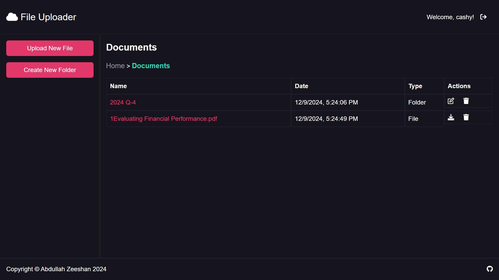

# File Uploader

## About

Cloud storage application enabling authenticated users to upload files and organize them into folders - stripped down version of Google Drive (or any other personal storage service).

## Features

### Authentication

- Sign up
- Sign in
- Sign out

### Core

- Uploading files
- CRUDing folders
- Uploading files inside folders
- Nesting folders
- Edit and delete files

## Technologies

- Express
- Prisma
- PostgreSql
- Passport
- EJS

## Future Improvements

- Improve responsiveness across devices.
- Setup a demo account sign in.
- Add a share folder functionality through link with a customizable expiry duration.

